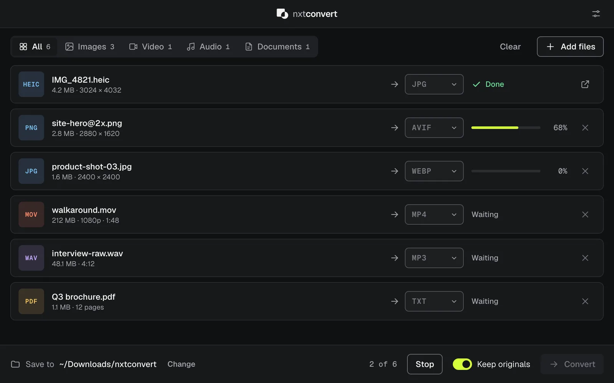

<p align="center">
  
</p>

<h1 align="center">nxtconvert</h1>

<p align="center">
  A lightweight desktop file converter for macOS, Windows and Linux.<br>
  Images, video, audio and documents, converted on your own computer.
</p>

<p align="center">
  <a href="https://github.com/0xt1m/nxtconvert-releases/releases/latest"></a>
  <a href="https://github.com/0xt1m/nxtconvert-releases/releases"></a>
  <a href="https://github.com/0xt1m/nxtconvert/actions/workflows/build.yml"></a>
</p>

<p align="center">
  
</p>

## Download

Get the latest version from **[nxtconvert.com](https://nxtconvert.com/#download)** or the
[releases page](https://github.com/0xt1m/nxtconvert-releases/releases/latest).

| System | File | Requirements |
| --- | --- | --- |
| macOS | `.dmg` | macOS 12 or later, Apple silicon |
| Windows | `.exe` installer | Windows 10 or 11, 64-bit |
| Linux | `.AppImage` or `.deb` | 64-bit |

The app checks for new versions when it starts and asks before installing anything.

## Features

- **Private.** Files are converted locally and never uploaded. The app works offline.
- **One window.** Drop files in, pick a format, press Convert.
- **Batches.** Mix images, video, audio and documents in one queue. Set each target or a whole category at once.
- **Safe output.** Converted files go to a folder you choose, and existing files are never overwritten.
- **Free.** No account, no ads, no file size limits, no watermarks.

## Supported formats

| Category | Converts from | Converts to |
| --- | --- | --- |
| Images | JPG, PNG, WEBP, AVIF, HEIC, GIF, TIFF, BMP, ICO, SVG | JPG, PNG, WEBP, AVIF, GIF, TIFF, BMP, ICO, PDF, HEIC (macOS) |
| Video | MP4, MOV, WEBM, MKV, AVI, M4V | MP4, MOV, WEBM, MKV, AVI, GIF, MP3 |
| Audio | MP3, WAV, FLAC, AAC, M4A, OGG, OPUS | MP3, WAV, FLAC, AAC, M4A, OGG, OPUS |
| Documents | DOCX, HTML, Markdown, TXT | PDF, HTML, TXT |

Some document conversions use tools that nxtconvert finds automatically when they are installed:

| Tool | Adds |
| --- | --- |
| [LibreOffice](https://www.libreoffice.org/download/) or [Pandoc](https://pandoc.org/installing.html) | DOC, ODT and RTF input; DOCX, ODT, RTF and EPUB output |
| [Poppler](https://poppler.freedesktop.org/) | PDF to text, HTML, and PNG or JPG (one image per page) |

Settings → *Converters on this computer* shows which tools were found. Formats that need a missing tool are
shown disabled, with the reason.

## Building from source

Requires [Node.js](https://nodejs.org/) 22 or later.

```sh
npm install
npm run dev        # run the app with hot reload
npm test           # build, then run every conversion this computer supports end to end
npm run typecheck
npm run dist       # build an installer for the current system
```

Installers must be built on the system they target, because the image and video engines are native
binaries. The [build workflow](.github/workflows/build.yml) tests and packages on macOS, Windows and Linux
for every push.

### Project structure

```
src/shared/formats.ts   supported formats and which engine handles each conversion
src/main/               Electron main process: converters, tool discovery, updates
src/preload/            the API exposed to the window
src/renderer/           the interface (React)
website/                the nxtconvert.com website
```

Release steps are described in [docs/RELEASING.md](docs/RELEASING.md), and changes in each version in
[CHANGELOG.md](CHANGELOG.md).

## Feedback

Found a bug or a file that won't convert? [Open an issue](https://github.com/0xt1m/nxtconvert/issues) with
the file type, your operating system and the error shown in the app.

## Acknowledgements

nxtconvert is built with [Electron](https://www.electronjs.org/), [React](https://react.dev/),
[sharp](https://sharp.pixelplumbing.com/) and [libvips](https://www.libvips.org/), [FFmpeg](https://ffmpeg.org/),
[libheif](https://github.com/strukturag/libheif), [mammoth](https://github.com/mwilliamson/mammoth.js),
[marked](https://marked.js.org/), [pdf-lib](https://pdf-lib.js.org/) and the [Geist](https://vercel.com/font)
typeface. These projects are distributed under their own licenses.
